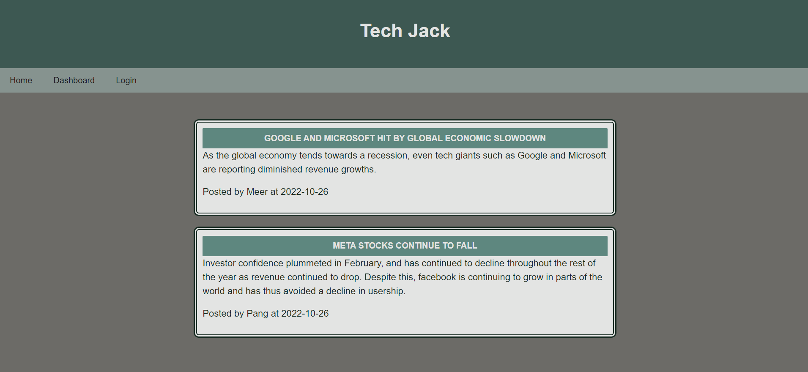

# Tech Blog

## Description

This application is a blog meant to include up-to-date information on tech news and related topics. Upon login, users can create their own posts or comment on others' posts. Users are also able to update their own posts, or delete them if they wish. To test out the blog without creating a new user, use "Meer" as the username, and "dasamsam" for the password.

## Table of Contents

- [Installation](#installation)
- [Usage](#usage)
- [Credits](#credits)
- [License](#license)
- [Tests](#tests)

## Installation

This application has been deployed onto Heroku and should run without any installation required.

## Usage

This application has been deployed onto Heroku, here is a link to the deployed site:

Here is an image of the deployed application's dashboard on loading:

## Contributors

Here is a list of contributors to this application:

N/A

## License

N/A

## Tests

N/A

## Questions

Here are two links to reach out to me:

Github: https://github.com/Honsumal

Email: 14leealastair@gmail.com